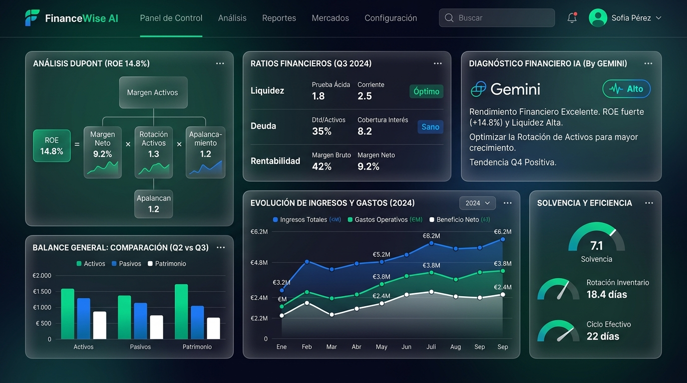
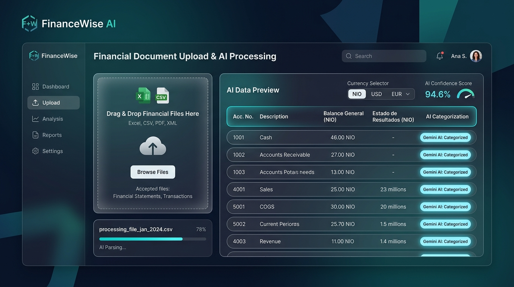
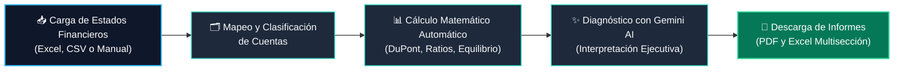

<div align="center">

# 📊 FinanceWise AI
### Plataforma de Inteligencia y Análisis Financiero Integral con IA

*Transforma datos contables en decisiones estratégicas claras, comprensibles y accionables.*

[](https://nextjs.org/)
[](https://turbo.build/pack)
[](https://react.dev/)
[](https://www.typescriptlang.org/)
[](https://tailwindcss.com/)
[](https://firebase.google.com/)
[](https://ai.google.dev/)
[](#-soporte-multi-moneda)

<br/>



</div>

---

## 🌟 Acerca de FinanceWise AI

**FinanceWise AI** es una solución integral orientada a empresas, contadores, directores financieros, consultores y emprendedores. Facilita la carga de estados financieros (Balance General y Estado de Resultados), automatiza el cálculo riguroso de razones financieras y diagnósticos DuPont, y genera interpretaciones ejecutivas asistidas por **Google Gemini** para transformar cifras frías en planes de acción inmediatos.

---

## 🚀 Características Principales

### 📈 Análisis DuPont Multietapa
* Descomposición precisa del **ROE (Retorno sobre el Patrimonio)** en sus tres pilares esenciales:
  * **Margen Neto:** Eficiencia operativa y de precios.
  * **Rotación de Activos:** Eficiencia en el uso de los activos de la organización.
  * **Multiplicador de Apalancamiento:** Grado de financiamiento mediante deuda versus capital propio.

### 🧭 Ratios e Indicadores Financieros Esenciales
* **Liquidez:** Razón Corriente, Prueba Ácida y Capital de Trabajo Neto.
* **Solvencia y Endeudamiento:** Razón de Deuda sobre Activos, Deuda sobre Patrimonio y Cobertura de Gastos Financieros.
* **Eficiencia y Actividad:** Rotación de Inventarios, Periodo Medio de Cobro y Rotación de Cuentas por Cobrar.
* **Rentabilidad:** Margen Bruto, Margen Operativo, Margen Neto, ROA y ROE.

### ⚖️ Punto de Equilibrio Físico y Monetario
* Identificación exacta de las unidades e ingresos mínimos requeridos para absorber la estructura de costos fijos y variables.

### 🤖 Diagnóstico Ejecutivo con IA (Gemini & Genkit)
* Generación de una narrativa financiera profesional en español que interpreta la salud global del negocio, detecta riesgos potenciales de liquidez o apalancamiento y sugiere recomendaciones tácticas.

<div align="center">
  
</div>

### 📥 Carga Flexible y Clasificación de Cuentas
* Carga rápida mediante arrastrar y soltar de hojas de cálculo **Excel (.xlsx, .xls)**, archivos **CSV** o captura manual.
* Normalización y mapeo automático de catálogo de cuentas contables.

### 🌎 Soporte Multi-Moneda
* Preparado para operar en:
  * 🇳🇮 **Córdobas Nicaragüenses (NIO)**
  * 🇺🇸 **Dólares Estadounidenses (USD)**
  * 🇪🇺 **Euros (EUR)**

### 📄 Exportación Ejecutiva Profesional
* Generación de reportes listos para juntas directivas en **PDF con texto nítido** y hojas de cálculo estructuradas en **Excel**.

---

## 🔄 Flujo de Trabajo



---

## 🛠️ Stack Tecnológico

| Capa | Tecnologías |
| :--- | :--- |
| **Frontend Framework** | [Next.js 15](https://nextjs.org/) con App Router & [React 18](https://react.dev/) |
| **Compilador & Bundler**| [Turbopack](https://turbo.build/pack) para tiempos de recarga ultrarrápidos |
| **Lenguaje** | [TypeScript 5](https://www.typescriptlang.org/) (tipado estricto) |
| **Estilos & UI** | [Tailwind CSS](https://tailwindcss.com/), Radix UI Primitives, Lucide Icons |
| **Visualización de Datos**| [Recharts](https://recharts.org/) |
| **Autenticación & Base de Datos** | [Firebase Auth](https://firebase.google.com/) y [Cloud Firestore](https://firebase.google.com/docs/firestore) |
| **Motor de Inteligencia Artificial**| [Google Gemini API](https://ai.google.dev/) vía [@genkit-ai/google-genai](https://firebase.google.com/docs/genkit) |
| **Procesamiento de Archivos** | [SheetJS (xlsx)](https://sheetjs.com/) |

---

## 💻 Instalación y Configuración Local

### 1. Prerrequisitos
* **Node.js**: v20.x o v22.x+ (recomendado LTS)
* **npm**: v10.x+
* Git

### 2. Clonar el Repositorio
```bash
git clone https://github.com/eduardoevz/financewise-ai.git
cd financewise-ai
```

### 3. Instalar Dependencias
```bash
npm install
```

### 4. Configurar Variables de Entorno
Copia el archivo de plantilla a tu entorno local:

```bash
# En Windows (PowerShell):
Copy-Item .env.example .env.local

# En Linux/macOS:
cp .env.example .env.local
```

Edita `.env.local` con tu API Key de Google Gemini y las credenciales de Firebase:
```env
GEMINI_API_KEY=tu_api_key_de_gemini
GOOGLE_GENAI_API_KEY=tu_api_key_de_gemini
GOOGLE_API_KEY=tu_api_key_de_gemini

# Opcional (si usas proyecto propio de Firebase):
NEXT_PUBLIC_FIREBASE_API_KEY=...
NEXT_PUBLIC_FIREBASE_AUTH_DOMAIN=...
NEXT_PUBLIC_FIREBASE_PROJECT_ID=...
```

### 5. Iniciar el Servidor de Desarrollo
```bash
npm run dev
```

Abre tu navegador en:
👉 **[http://localhost:3000](http://localhost:3000)**

---

## 📁 Estructura del Proyecto

```
financewise-ai/
├── docs/                     # Documentación y recursos gráficos
│   └── assets/               # Imágenes y diagramas del proyecto
├── src/
│   ├── ai/                   # Flujos y configuración de Genkit con Gemini
│   ├── app/                  # Rutas y páginas de Next.js App Router
│   │   ├── (auth)/           # Rutas públicas (login, register)
│   │   ├── dashboard/        # Panel principal, análisis y reportes
│   │   ├── welcome/          # Onboarding y validación de roles
│   │   ├── layout.tsx        # Layout raíz con AuthProvider
│   │   └── page.tsx          # Enrutamiento condicional inicial
│   ├── components/           # Componentes de interfaz (UI primitives, cards)
│   ├── context/              # Proveedor de estado global de autenticación
│   ├── hooks/                # Custom React hooks (useAuth, useToast)
│   ├── lib/                  # Lógica de negocio, cálculos financieros y Firebase
│   └── types/                # Definiciones de TypeScript
├── package.json              # Dependencias y scripts
└── tailwind.config.ts        # Configuración de diseño y paleta
```

---

## 👥 Equipo y Colaboradores

* **Eduardo Velásquez** ([@eduardoevz](https://github.com/eduardoevz)) — *Creator & Lead Developer*
* **Francisco Pilarte** ([@franciscopilarte](https://github.com/franciscopilarte) · [fpilarteespinosa@gmail.com](mailto:fpilarteespinosa@gmail.com)) — *Project Collaborator*

---

## 📄 Licencia

Este proyecto está distribuido bajo la licencia MIT. Consulta el archivo `LICENSE` para más información.

<div align="center">
  <sub>Desarrollado con dedicación para revolucionar el análisis financiero en el mundo hispanohablante.</sub>
</div>